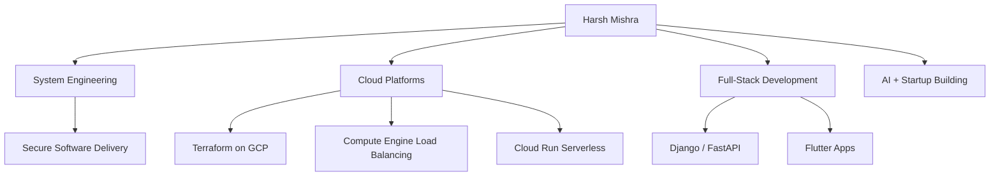

# 

<p align="center">
  
</p>

<table>
  <tr>
    <td width="52%" valign="top">

### `whoami`
```bash
Harsh Mishra
Engineering Student • Aspiring Innovator
System Engineering • Full-Stack • AI + Startups
Farukhnagar, Haryana, India
```

I build practical products that combine **cloud systems**, **developer tooling**, and **real-world usability**.

   </td>
   <td width="48%" valign="top">

### `focus`
- Reliable software delivery  
- Cloud infrastructure (IaC + deployment)  
- Product-minded engineering  
- Startup-oriented execution  

### `connect`
- [LinkedIn](https://www.linkedin.com/in/harshmishrahm01/?lipi=urn%3Ali%3Apage%3Ad_flagship3_feed%3Bzwr1eI13SB%2BTVcgW8ibu0g%3D%3D)  
- `harshmishrahm01@gmail.com`

   </td>
  </tr>
</table>

## `2D skill map`


## `certifications`
| Track | What it shows | Credly |
|---|---|---|
| Secure Software Delivery | Building safer, production-ready software practices | [View](https://www.credly.com/badges/864b3f07-8b27-46c8-8e7d-46581fcabacc/public_url) |
| Build Infrastructure with Terraform on Google Cloud | Infrastructure as code and cloud provisioning skills | [View](https://www.credly.com/badges/2f6ddc1c-61a9-4efa-ae62-83060281cccd/public_url) |
| Implement Load Balancing on Compute Engine | Designing traffic routing and availability on GCP compute | [View](https://www.credly.com/badges/5d1f993b-09ec-4cef-a0e5-8cc4ecb40708/public_url) |
| App Building with AppSheet | Rapid no-code/low-code app delivery workflows | [View](https://www.credly.com/badges/1eb16b3a-5ebe-4c38-aeda-562164eb235f/public_url) |
| Building Serverless Applications with Cloud Run | Deploying scalable serverless workloads on Cloud Run | [View](https://www.credly.com/badges/0338fe0f-6c86-4ae3-b7d8-3c6c80368175/public_url) |

## `original repos (non-fork)`
| Repo | What I built |
|---|---|
| [papers-for-windows](https://github.com/cosmicvi/papers-for-windows) | Native Windows port of GNOME Papers for modern multi-format document viewing |
| [cat-bot](https://github.com/cosmicvi/cat-bot) | WhatsApp commerce bot with catalog, ordering flow, and receipt handling |
| [Taskboard](https://github.com/cosmicvi/Taskboard) | Django task-and-notes board for simple productivity workflows |
| [tasker-2.0](https://github.com/cosmicvi/tasker-2.0) | Flutter 7-day scheduler with streak logic and sleep-aware planning |
| [tracker-1.0](https://github.com/cosmicvi/tracker-1.0) | Offline-first Flutter tracker for Marvel media exploration |
| [elemento-f](https://github.com/cosmicvi/elemento-f) | Multi-module Dart/Rust experimentation workspace |
| [cosmicvi](https://github.com/cosmicvi/cosmicvi) | This profile repository |
